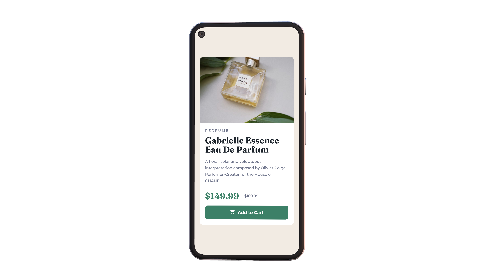
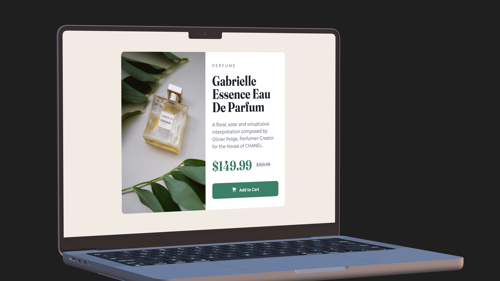

# Frontend Mentor - Product preview card component

This is a solution to the [Product preview card component challenge on Frontend Mentor](https://www.frontendmentor.io/challenges/product-preview-card-component-GO7UmttRfa). Frontend Mentor challenges help me improve my coding skills by building realistic projects.

## Table of contents

- [Frontend Mentor - Product preview card component](#frontend-mentor---product-preview-card-component)
  - [Table of contents](#table-of-contents)
  - [Overview](#overview)
    - [The challenge](#the-challenge)
    - [Screenshot](#screenshot)
    - [Links](#links)
    - [Built with](#built-with)
    - [What I learned](#what-i-learned)
    - [Continued development](#continued-development)
    - [Useful resources](#useful-resources)
  - [Author](#author)

## Overview

As the second mini project on Frontend Mentor, it was a good challenge to learn more on CSS! I'm so excited to share it with you.

### The challenge

The challenge is to build out this product preview card component and get it looking as close to the design as possible.

As well as making it responsive for small phones, I tried to make it good looking for large screens as well. The page is based on mobile-first workflow and it is responsive for different screen sizes. Another challenge was keeping the HTML semantic, and the CSS clean.

### Screenshot




### Links

- Live Site URL: [Product preview card component](https://ohsorrow.github.io/)
- Solution URL: [Solution URL]()

### Built with

- Semantic HTML5 markup
- CSS custom properties
- Flexbox
- [Font Awesome](https://fontawesome.com) - For shopping cart icon

### What I learned

Using Font Awesome icons inside the button:

```html
<button class="add-button">
  <i class="fa-solid fa-cart-shopping"></i> Add to Cart
</button>
```

Switching images based on the device screen size:

```html
<picture>
  <source
    media="(min-width: 768px)"
    srcset="./images/image-product-desktop.jpg"
  />
  
</picture>
```

### Continued development

Since I learned a lot on this project, I'm looking forward to trying more challenges from Frontend Mentor.

### Useful resources

- [Font Awesome](https://fontawesome.com) - Font Awesome is the internet's icon library.
- [Google Fonts](https://fonts.google.com) - Google Fonts is a library of more than 1,400 open source font families and APIs for convenient use via CSS and Android.
- [Device Frame](https://deviceframes.com/) - Generate beautiful 3D device scenes to showcase your app UI.

## Author

- Telegram - [Aram Moradian](https://t.me/OhSorrow)
- Frontend Mentor - [@OhSorrow](https://www.frontendmentor.io/profile/OhSorrow)
- GitHub - [OhSorrow](https://github.com/OhSorrow)
